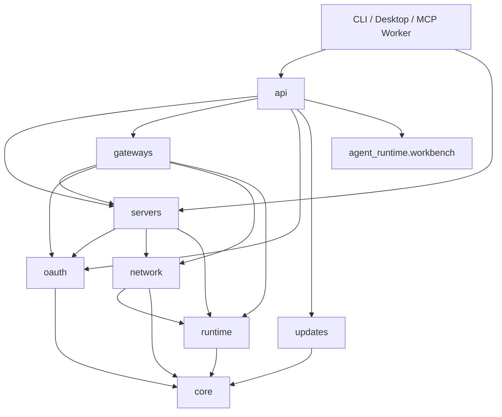

# Agent Workbench 包结构重构设计

## 1. 设计原则

1. **按领域归档，不按文件类型归档**：Server、Gateway、OAuth、Update 各自拥有模型、存储与服务实现。
2. **依赖向内收敛**：入口/API 可以依赖领域服务；领域服务可以依赖 core/runtime；core 不反向依赖入口、UI 或管理器。
3. **先拆后移**：先把大文件中的职责提取成可独立测试的模块，再删除旧实现；不进行一次性全仓机械改名。
4. **兼容面最小而明确**：保留真正的公开入口和模块命令；项目内部测试与 import 迁移到新路径。
5. **行为等价优先**：本次不调整配置 schema、权限规则、OAuth 协议或 Server/Gateway 生命周期。

## 2. 目标目录

```text
agent_workbench/
├── __init__.py                 # 公开 Python API
├── __main__.py                 # python -m agent_workbench
├── cli.py                      # 稳定 CLI 入口
├── desktop.py                  # 稳定桌面入口
├── desktop_api.py              # DesktopAPI 兼容转发
├── mcp_worker.py               # 稳定内部进程入口
│
├── core/
│   ├── __init__.py
│   ├── config.py               # LaunchConfig / NetworkConfig
│   ├── resources.py            # 资源与 frozen 路径
│   ├── settings.py             # 用户设置目录与读写
│   └── version.py              # 桌面版本
│
├── runtime/
│   ├── __init__.py
│   ├── mcp_process.py          # MCP 子进程控制
│   ├── process.py              # 通用进程工具
│   └── permission_broker.py    # 桌面授权 Broker
│
├── servers/
│   ├── __init__.py
│   ├── launcher.py             # 单 Workspace 启动器
│   ├── manager.py              # 多 Server 生命周期管理
│   ├── models.py               # MCPServerProfile
│   └── store.py                # ServerProfileStore
│
├── gateways/
│   ├── __init__.py
│   ├── models.py               # Gateway 配置、Member、LaunchInfo、诊断 DTO
│   ├── store.py                # GatewayProfileStore
│   ├── process.py              # Gateway 子进程配置与控制
│   ├── diagnostics.py          # HTTP/OAuth/路由诊断
│   ├── launcher.py             # 启停编排与 watcher
│   └── manager.py              # 多 Gateway 生命周期管理
│
├── oauth/
│   ├── __init__.py
│   ├── persistence.py          # issuer/registry/token-secret 持久化
│   └── client_store.py         # OAuth Client 查询与撤销
│
├── updates/
│   ├── __init__.py             # 保持 agent_workbench.updates 导入语义
│   ├── release.py              # Release 查询、命名、TLS、版本比较
│   ├── installer.py            # 平台安装目标与 helper
│   └── manager.py              # 下载、校验、状态机与重启编排
│
├── api/
│   ├── __init__.py
│   ├── desktop.py              # 组合 DesktopAPI Facade
│   ├── base.py                 # 初始化、日志、bootstrap、文件选择
│   ├── approvals.py            # Permission/Workflow approval API
│   ├── workbench.py            # Skill/MCP Connection/Workflow API
│   ├── services.py             # Server/Gateway CRUD 与 payload 转换
│   ├── oauth.py                # OAuth Client API
│   └── update.py               # 更新 API
│
├── network/
│   ├── __init__.py             # 保持轻量
│   ├── specs.py                # Provider 元数据
│   └── ...                     # 现有 Provider 实现
├── executables/                # 保持现有目录
└── web/                        # 保持现有目录
```

最终根目录中的业务实现只保留入口与 `desktop_api.py` 兼容转发；其余旧模块完成迁移后删除。兼容转发文件不得包含业务分支。

## 3. 依赖方向



约束：

- `core` 不导入 `api/servers/gateways/oauth/updates`。
- `runtime` 不导入 `api`。
- `network/__init__.py` 不主动导入 Factory，防止 `core.config -> network.specs -> network.__init__ -> factory -> core.config` 循环。
- 内部调用使用具体模块路径，例如 `from agent_workbench.network.factory import create_network_provider`，不依赖重导出的包级符号。
- 子包 `__init__.py` 只导出纯类型或轻量 Facade，不启动线程、子进程、网络或 UI。

## 4. 大文件拆分

### 4.1 DesktopAPI

采用显式 Mixin Facade，保持 pywebview 仍看到一个 `DesktopAPI` 对象及原方法名：

```python
class DesktopAPI(
    ApprovalAPI,
    WorkbenchAPI,
    ServiceAPI,
    OAuthAPI,
    UpdateAPI,
    DesktopBaseAPI,
):
    pass
```

共享状态由 `DesktopBaseAPI.__init__` 初始化。Mixin 通过一个仅用于类型检查的 `DesktopAPIContext` Protocol 声明 `_server_manager`、`_gateway_manager`、`_workbench_manager`、`_update_manager` 等属性，避免运行期基类形成环。

方法归属：

| 模块 | 职责 |
|---|---|
| `api/base.py` | 生命周期、日志、设置、bootstrap、Provider 列表、文件选择、外部 URL、可执行程序发现 |
| `api/approvals.py` | Permission Broker 与 Workflow approval |
| `api/workbench.py` | Target/Catalog/MCP Connection/Skill/Workflow/Run |
| `api/services.py` | Server/Gateway payload、资源冲突检查、CRUD、启动停止、诊断 |
| `api/oauth.py` | Server/Gateway OAuth Client 查询与撤销 |
| `api/update.py` | 检查、下载、状态、安装与关闭窗口 |

`agent_workbench/desktop_api.py` 只保留：

```python
from .api.desktop import DesktopAPI

__all__ = ["DesktopAPI"]
```

测试 patch 迁移到实际定义模块，不依赖兼容转发模块的全局变量。

### 4.2 Gateway

当前 `gateway_launcher.py` 同时承担 DTO、HTTP Client、OAuth 诊断、启动编排和 watcher。拆分为：

- `gateways/models.py`：`GatewayLaunchConfig`、`GatewayChildProfile`、LaunchInfo、Diagnostic DTO；不得启动进程。
- `gateways/diagnostics.py`：JSON/Form HTTP、OAuth authorization-code/PKCE、Runtime/Server Card/metadata/auth challenge 检查；构造时接收日志、LaunchInfo 获取器和持久化依赖。
- `gateways/process.py`：原 Gateway 子进程配置、命令构建和进程包装。
- `gateways/launcher.py`：仅负责状态锁、网络 Provider、origin 启停、single/multi 分支、watcher 和回滚。
- `gateways/store.py`：持久化列表、冲突检查和端口分配。
- `gateways/manager.py`：多个 launcher 的生命周期集合。

启动顺序、固定/动态 URL 分支、OAuth issuer 绑定时机和失败回滚保持原测试定义的顺序。

### 4.3 Update

- `updates/release.py` 接收现有 `updates.py` 的 Release 查询、平台资产命名、版本比较、代理和 GitHub TLS Context。
- `updates/installer.py` 接收安装目标判断、checksum 解析、平台 helper 脚本与 Windows installer 启动。
- `updates/manager.py` 保留 `UpdateStatus`、下载线程、SHA-256 校验、状态切换和安装重启编排。
- `updates/__init__.py` 重导出当前调用方使用的 `ReleaseInfo`、查询函数、版本工具和 `UpdateManager`。

## 5. Server、OAuth、Core 与 Runtime 迁移

这些模块先保持业务代码等价移动，再做小范围拆分：

- `server_profiles.py` 拆成 `servers/models.py` 与 `servers/store.py`。
- `launcher.py`、`server_manager.py` 迁入 `servers/`。
- `oauth_persistence.py`、`oauth_client_store.py` 迁入 `oauth/`。
- `config.py`、`resources.py`、`user_settings.py`、`version.py` 迁入 `core/`。
- `mcp_process.py`、`process_utils.py`、`permission_broker.py` 迁入 `runtime/`。
- `network_specs.py` 迁入 `network/specs.py`，同时轻量化 `network/__init__.py`。
- `workbench_manager.py` 迁入 `api/workbench_manager.py`，避免与 `agent_runtime.workbench` 的领域包混淆。

`mcp_worker.py` 保留在根目录作为 `python -m agent_workbench.mcp_worker` 稳定入口，内部转发到 `runtime.mcp_process.run_internal_mcp_server`。

## 6. 兼容策略

### 6.1 必须稳定

| 入口 | 策略 |
|---|---|
| `python -m agent_workbench` | `__main__.py` 保留 |
| 根目录 `desktop.py` | 继续导入 `agent_workbench.desktop.main` |
| `python -m agent_workbench.mcp_worker` | 根模块保留薄入口 |
| `agent_workbench.DesktopAPI` 以外的当前 `__all__` | `__init__.py` 从新模块重导出同一对象 |
| `agent_workbench.desktop_api.DesktopAPI` | 保留薄转发模块 |

### 6.2 项目内部迁移

- 测试、构建脚本和应用内部 import 全部切到真实新路径。
- 测试 patch 真实定义位置；不要求旧内部模块路径继续支持 monkeypatch。
- 文档中的模块路径同步更新，唯独 `agent_workbench.mcp_worker` 保持不变。

### 6.3 不承诺的内部路径

未通过 `agent_workbench.__all__` 导出、未作为模块入口、未写入用户配置的深层旧模块路径视为内部实现。迁移后可删除，不为其保留大量根目录 shim，否则无法实现根目录降噪目标。

## 7. 数据与安全

- `settings_dir()`、Server/Gateway store 文件名、OAuth issuer 哈希目录、token secret 和 Workbench 资产根目录保持不变。
- 移动模块不改变 pickle/类路径，因为当前持久化格式为 JSON，不序列化 Python 类路径。
- Permission Broker 的 HMAC、请求目录、Server ID 绑定与环境剥离逻辑原样迁入 `runtime/permission_broker.py`。
- TLS、OAuth、网络 Provider 和更新 checksum 校验不得弱化。
- 兼容模块不捕获或吞掉原实现异常。

## 8. 迁移顺序

1. 新建 `core`、`runtime` 与轻量 `network.specs`，迁移底层依赖。
2. 迁移 `oauth` 与 `servers`，更新 `agent_workbench.__init__`。
3. 重组 `gateways` 数据模型、进程、诊断、launcher、store、manager。
4. 拆分 `updates` 包。
5. 拆分 `api` 并保留 `desktop_api.py` 转发。
6. 更新 CLI、桌面入口、构建脚本、测试 patch 和文档。
7. 删除已无调用方的旧业务文件。
8. 执行导入 smoke、领域测试、Python 全量测试、前端测试/构建、服务器部署测试和 PyInstaller smoke。

每一步完成后先运行该领域测试；出现行为差异时在当前步修复，不把多个失败阶段叠加。

## 9. 测试设计

### 9.1 新增测试

- 遍历导入所有新子包，确认无循环依赖和导入副作用。
- 验证 `agent_workbench.__all__` 导出对象来自新模块。
- 验证 `agent_workbench.desktop_api.DesktopAPI` 与 `agent_workbench.api.desktop.DesktopAPI` 对象身份一致。
- 验证 `python -m agent_workbench --help` 与 Worker 命令构建仍使用稳定入口。
- 验证单/多 Workspace、Gateway 诊断、OAuth persistence、更新 checksum/helper 结果与现有 fixture 一致。

### 9.2 回归矩阵

| 层级 | 验证 |
|---|---|
| Core/Runtime | config、resource、version、broker、process tests |
| Server/Gateway | profiles、manager、launcher、process、network tests |
| API/UI | desktop API、前端测试、TypeScript/Vue、Vite build |
| Update | update naming、download、checksum、installer tests |
| Server deploy | CLI preflight、systemd/Docker deployment tests |
| Release | `compileall`、import smoke、PyInstaller onedir smoke |

PyInstaller 构建命令增加 `--collect-submodules agent_workbench`，确保 Mixin、Worker 与新子包被收集。Smoke 至少验证产物存在、应用可执行文件能启动到参数处理阶段，并能定位打包后的 Web 资源。

## 10. 风险与控制

| 风险 | 控制 |
|---|---|
| 循环导入 | core/runtime 单向依赖；轻量 `__init__`；逐包 import smoke |
| patch 路径失效 | 测试迁移到实际定义模块；兼容路径只保证导入，不保证内部 monkeypatch |
| PyInstaller 漏收集 | 显式 collect-submodules + smoke build |
| Gateway 行为漂移 | 先提取 DTO/diagnostics，再移动 launcher；复用既有顺序测试 |
| 用户配置丢失 | 不修改路径/schema；使用旧 fixture 做 round-trip |
| 当前 UI 改动被覆盖 | 重构只处理 Python 包和必要构建脚本；前端在最终阶段单独回归 |

## 11. 设计完成判据

- 目标目录、依赖方向、兼容面和三个大文件的拆分职责均明确。
- 每个迁移阶段都有独立测试门槛。
- 不依赖一次性全仓移动才能恢复可运行状态。
- 需求 R-1 至 R-7 均能映射到设计与后续任务。
