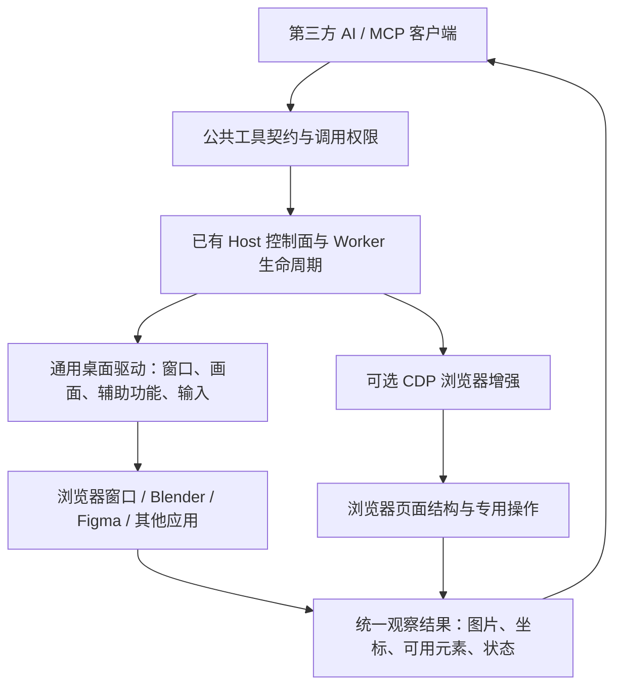

# Workbench 0.4.x：通用桌面 Computer Use

状态：2026-09-11 macOS + Windows 源码主链和 PyInstaller `.app` Host Worker 打包 smoke 已完成；Linux Desktop 支持已暂时移出 0.4.x 范围，真实应用/TCC/Windows 实机发布门槛仍待验收。
源码基线：从 `071e2fa` 开始实施；当前工作树已进入 0.4.x Desktop Computer Use 实现阶段。

本计划取代上一版整改文档中“通用桌面后端后续实现”的范围决定。上一版已完成的工具契约、Host 生命周期、图片返回等整改继续复用；其已记录的测试结果不是本版本桌面能力的验收结果。

## 1. 版本目标

AI 通过 Workbench 看见并操作浏览器、Blender、Figma 等桌面应用页面。实现一次通用桌面观察与输入能力后，新增普通应用不需要新增产品专用 Provider、MCP 或沙箱路径补丁。

Workbench 负责发现目标、采集画面、检查权限、执行输入和回传结果。外部 AI 负责理解页面、决定动作和判断任务是否完成。Workbench 不内置第二个模型来替 AI 决策。

浏览器与 Blender、Figma 都是第二类 Host 工具的目标。现有 Runtime / Host 执行边界保持不变；Computer Use 是 Host 能力，不是第三类工具模型。

## 2. 核心调整

**统一对象从 Browser Session 改为有身份和权限绑定的桌面目标会话。**

- 应用、窗口是通用目标，不要求应用提供 CDP 或专用 API。
- 图像是基础观察信息；系统提供的辅助功能信息是可选补充。
- 截图、点击、输入、滚动、按键、拖拽是基础能力，按操作系统实现。
- CDP 保留为浏览器页面结构、导航、调试等增强能力，不能成为通用观察的必经路径。
- 基础 Computer Use 通过现有 Workbench MCP 服务公开；默认注册能力，实际操作受平台支持、系统权限和用户授权约束。
- Figma/Blender 专用 MCP 用于结构化专业功能，用户自行选择，基础看图和页面操作不依赖它们。

图像采集仍然必要。需要淘汰的是“全部界面能力都建立在 CDP 浏览器上”的范围限制，而非截图作为模型视觉输入的机制。

## 3. 架构



复用当前 Host 连接、generation、错误关联和图像结果出口。平台驱动按系统实现，而不按 Chrome/Blender/Figma 分别复制一套功能。

## 4. 目录组织与对 AI 的工具契约

### 4.1 desktop 目录统一管理

Desktop 的原子操作按领域集中管理，沿用当前工具的 definitions / handlers 组织方式。以下为待实现目录，不表示已有代码：

```text
agent_runtime/tools/desktop/
    __init__.py       # 注册唯一公共 desktop 工具
    definitions.py   # 公共工具定义与由操作表生成的 schema
    operations.py    # 原子操作表：参数、权限需求、handler 引用
    handlers.py      # 规范化调用，复用 Runtime 授权与 Host dispatch
    models.py        # Runtime 侧需要的目标/观察契约

agent_workbench/host_capabilities/desktop/
    __init__.py
    provider.py      # 对接现有 Host Worker
    sessions.py      # 目标身份、坐标映射、输入仲裁
    drivers/         # 按操作系统实现窗口、捕获、辅助功能和输入
```

两个 desktop 包分别属于 Runtime 契约层与 Host 执行层，不能为了物理上只留一个目录，让 Runtime 导入原生 GUI 驱动。共享的纯数据契约只能有一个来源；models 不复制已有传输模型。平台依赖延迟加载，不影响无 GUI 的 Runtime。

所有 desktop 原子操作定义都留在 desktop 包内，不散落到 system、browser 或根目录大文件；公共 Registry、权限枚举、Worker 注册点只做必要接线。前端复用 usePermissionRequests，桌面目标状态放在独立 composable，展示组件不承担授权决策。

### 4.2 内部原子，对外一个领域入口

本次修订取代初稿的九个公开 desktop_* 工具：**对 MCP 客户端只公开一个 desktop 工具，通过 action 选择内部原子操作。** 不再按应用或按按键扩展公开子工具，也不建立 desktop_manage / desktop_click 等别名。

| desktop 的 action | 职责 |
| --- | --- |
| targets | 有界列出可选择的应用/窗口及支持情况，避免全量进程扫描 |
| attach | 绑定一个明确目标，声明 observe 或 control 模式，创建当前客户端的桌面会话 |
| observe | 返回目标窗口图片、尺寸、坐标映射、可用辅助功能元素 |
| click | 按当前观察中的坐标或元素引用点击，支持明确的按键及点击次数 |
| type | 向明确目标输入文本 |
| keypress | 按键或组合键 |
| scroll | 在目标区域滚动 |
| drag | 在指定目标内执行有界拖拽路径 |
| detach | 释放控制会话，不退出用户应用 |

调用形态示例：`desktop({"action":"observe","session_id":"…"})`。内部动作保持可独立测试，但不注册为假装可直接 invoke 的 MCP 工具。已有 host_status / host_diagnostics / host_reconnect 继续复用；attach 不隐式启动程序或执行命令。

### 4.3 紧凑入口必须满足的契约约束

- 单一操作表生成公共 inputSchema、操作说明、权限解析和分发映射，避免维护不同列表。顶层 schema 为 object，以 action 的 const + oneOf 分支严格约束参数；不能只列一组全可选字段。
- observe 必须有 session_id；click 必须有 observation_id 和一种明确 target；type 必须有文本；attach 必须有目标和模式。参数验证发生在申请授权与 Host dispatch 前。
- 每次按已验证的 action 和目标计算实际权限：observe 只需桌面观察；输入动作需桌面控制，默认动作后观察还需观察权限；detach 只允许释放本客户端的会话，不因撤销授权而阻止释放。targets 只提供选择所需的最小元数据，不在未授权时泄漏窗口内容或敏感标题。
- 不给入口添加 filesystem.write 权限并集。能力检查不能先把所有动作权限合并后再分发；现有静态 ToolDefinition 权限路径需要增加通用的调用权限解析能力，复用原授权链路，不为 desktop 建立旁路。
- MCP tools/list 的 annotations 属于整个工具，不能按一次调用的 action 动态变化。desktop 包含输入动作，因此保守标注 readOnlyHint=false、destructiveHint=true、idempotentHint=false、openWorldHint=true；服务端仍按真实动作实施最小权限。不能用 fake_readonly 掩盖这一事实。
- 单入口的代价是第三方客户端可能把观察调用也作为可写工具提示确认。Workbench 无法保证第三方客户端按 action 细分自己的确认 UI；不为消除该提示新增兼容入口。若将来只读客户端成为硬要求，应显式重新评审读写分离契约。
- Catalog 只公布真实公共名称 desktop；如描述子能力，必须写出 mcp_tool=desktop 与固定 action。内部 click 不是 mcp_tool=desktop_click。MCP 调用和 Workflow 都走相同公共契约，不绕过校验与授权。

[MCP 工具 schema 与 annotations 定义](https://modelcontextprotocol.io/specification/2025-11-25/schema) 是上述静态提示边界的依据。不同 MCP 客户端需要用真实集成验证此 schema；不以客户端私有字段或分支兼容来修补。

browser_* 保留现有 CDP 专业语义，不在本轮重做其公开接口；通用窗口观察和输入统一使用 desktop。两者共有图像封装和会话基础设施直接抽取复用，不进行新旧协议互转。

## 5. 观察结果

每次观察返回：

- 标准 MCP image 内容，直接交给模型，不仅返回本地文件路径。
- session_id、host_generation、observation_id 和时间。
- 应用实例与窗口的有界身份信息，窗口关闭/重建后不复用旧目标。
- 图像宽高、窗口边界、显示器标识、缩放和图像坐标到输入坐标的映射。
- 可用辅助功能信息；若应用不提供，明确返回不支持，而不是认为观察失败。
- minimized/occluded/visible 等可确定状态，以及 driver 支持范围；未知不能假报 visible。

默认按需采集一帧，动作后再次采集。0.4.x 不以持续视频上传、视频编码和录像存储为前提。

需要连续捕获才能可靠取帧的平台实现可以内部使用捕获流，但模型接口仍接收有身份的观察帧。屏幕捕获权限不自动代表允许采集所有应用或后台持续上传。

## 6. 执行与防止误操作

- 模型输入坐标以本次图像为准，由驱动映射到系统坐标；覆盖 Retina、多显示器、负坐标、窗口移动和缩放。
- 动作绑定 session、目标和 observation；generation、窗口身份或映射失效时要求重新观察。
- observation_id 只标识观察上下文，不能证明整个应用内容未变化；执行前仍检查目标与焦点，动作后验证画面。
- 每个系统桌面上的输入共享仲裁，避免多个 Profile/AI 同时移动鼠标或抢焦点；目标变化不能默默切到其他应用。
- 需要激活窗口的操作提前说明并检查授权。跨窗口弹窗作为相关新目标处理，归属验证失败则重新选择/授权，不凭标题猜测。
- 原子动作后默认返回一次有界观察。动作执行成功但截图失败时分别报告，不建议重放可能已提交的操作。
- 提供即时停止控制入口；停止后清除排队输入。detach 只释放控制，绝不等价于关闭 Blender/Figma。

优先保证可见窗口上的通用操作。后台、最小化、受保护窗口的观察和输入支持由平台驱动真实报告，不把后台能力作为无条件承诺。

## 7. 权限与平台边界

1. 系统权限与 Workbench 的目标授权分开：图像采集、辅助功能/输入权限按实际平台能力检查。
2. 区分桌面观察与桌面控制；看图不能获得键盘鼠标控制，原 browser_control 不能扩大为任意桌面权限。
3. 目标授权绑定客户端、Profile、应用/窗口范围和会话；应用重启、窗口 ID 复用及 Worker generation 更新后重新校验。
4. 自有 Browser/CDP Session 与用户原有应用的资源所有权分开，GC 不处理用户数据。
5. 使用稳定的桌面 helper 身份、平台权限入口和打包配置；必须用包装后的应用验证权限归属，不能只在 Python 开发环境测试。
6. 不支持的平台仍正常运行 Runtime，准确报告 desktop capability unsupported，不在启动时强制导入 GUI 依赖。

开发可先在当前 macOS 环境实现；0.4.x 每个平台是否可发布由该平台的实测门槛决定。Windows/其他平台不能仅凭接口存在标记 supported/ready，也不以本计划隐式取消原有平台支持。

### 7.1 Workbench 授权弹窗与系统权限

0.4.x 必须有 Workbench 自己的应用授权弹窗。现有 App.vue、usePermissionRequests.ts、ApprovalAPI 与 Permission Broker 已提供通用审批基础，但当前并没有 desktop 应用会话授权和永久应用授权；不能将这些新能力标记为已实现。

授权分为三个独立问题：

| 层次 | 解决的问题 | 交互位置 |
| --- | --- | --- |
| 客户端认证 | 谁在连接哪个 Workbench 服务 | 复用现有 MCP/OAuth 连接认证流程 |
| 应用授权 | 该客户端能否看见或控制这个应用/窗口，持续多久 | Workbench 自己的授权弹窗 |
| 系统授权 | Workbench 的实际捕获/输入进程是否获得系统权限 | macOS 系统弹窗或系统设置 |

用户参考图一展示应用使用授权，图二展示操作系统屏幕访问授权。Workbench 实现对应的两层体验，但系统提示的文案、归属名称、出现次数取决于 macOS 版本、捕获 API 和签名后的实际执行进程，不保证复刻参考图。获得屏幕权限不等于正在保存录像，也不要求为纯页面观察采集音频。

macOS 的屏幕访问由系统隐私设置控制；控制电脑所需的辅助功能权限另行检查，应用内部批准不能替代系统授权。参考 [Apple 屏幕与系统音频权限](https://support.apple.com/en-ie/guide/mac-help/mchld6aa7d23/mac) 与 [Apple 隐私与安全设置](https://support.apple.com/en-mide/guide/mac-help/mchl211c911f/mac)。

Workbench 弹窗示例：“允许客户端 X 通过公司开发环境观察并控制 Blender？”显示可信应用名称/身份、目标窗口范围、观察/控制能力和有效期，不以一段任意 AI 文本作为授权范围。

- 拒绝：本次操作不执行，返回明确拒绝结果。
- 仅允许本次：绑定这次具体请求及其默认动作后观察，不放行下一条输入。
- 允许本次桌面会话：限当前已认证主体、Profile、目标应用/窗口范围和能力集合；会话结束、到期、Profile 停止或用户撤销后失效。同一范围内每次点击不重复弹窗。
- 始终允许此应用：用户显式选择后保存同一主体、Profile、可信应用身份与能力范围的授权规则；设置页可查看和撤销。应用路径替换、身份无法确认、客户端变化或请求扩大范围时重新授权，不保存全桌面通配许可。

“本次桌面会话”不能伪装成第三方 AI 的“本次对话”：普通 MCP 请求未必提供可验证的聊天边界，使用 Workbench 自己管理的会话期限。持久规则允许后续建立新会话，但旧窗口 ID、坐标、观察和 generation 仍必须作废并重新绑定。

复用现有审批队列及 UI 状态管理，补充作用域模型与持久规则管理；不把现有工具链 remember 分支当成桌面永久授权。安全、可信、危险模式均不隐式扩大为任意桌面控制；有效的目标授权规则可以免重复询问，系统权限始终独立。

请求流程：验证客户端和参数 → 检查 Host/目标及系统可行性 → 匹配目标授权或提交 Workbench 审批 → 必要时引导用户完成系统授权 → 重新检查目标、权限和焦点 → 执行 → 返回观察。已知不支持或目标不存在时直接失败，不弹无效审批。

审批超时、调用取消、Profile 停止会使待批请求失效并清除对应排队动作；恢复后不得执行之前的迟到批准。实际输入前再次检查授权。AI 的桌面工具不能操作 Workbench 自身的授权按钮或系统权限弹窗完成自我授权；这些交互由本地用户完成。

## 8. 实施阶段

### D0：核对现有基础，固定桌面契约

- [x] 已完成源码实现。
- 复核 `071e2fa` 的 Registry、Host Worker、generation、fail-fast、图片结果和权限实现，复用已完成部分。
- 按 desktop 目录组织原子操作，固定唯一公开 desktop 工具及平台驱动接口；schema、Catalog、权限解析和分发源自同一操作表。
- Browser 的历史验收单独记录；0.4.x 新增桌面测试不能复用 Browser mock 冒充通过。

### D1：先交付“看见任何授权窗口”

- [x] macOS、Windows 已实现目标发现、绑定和窗口图像采集。
- [x] Linux Desktop Driver 已移除；Linux 暂不属于 0.4.x Desktop Computer Use 发布范围。
- [x] Windows Host Worker 启用 Per-Monitor DPI awareness；观察结果解析窗口相交显示器、DPI 与缩放元数据，跨屏窗口明确返回 `multiple`。
- 实现目标发现、attach、系统权限检测和按需窗口捕获。
- 复用 MCP 图片输出，提供真实窗口/图像元数据和可用辅助功能信息。
- 同一观察工具在浏览器、Blender、Figma 上工作，不依赖 CDP、不安装应用专用 MCP。
- 明确错误：权限缺失、目标消失、窗口不可捕获、平台不支持，不把空白图片当成成功。

### D2：通用输入与观察闭环

- [x] 已实现坐标点击、文本、组合键、滚动、拖拽、焦点/几何复核、共享输入互斥和本地停止控制。
- [x] Windows 控制能力按当前 input desktop 与目标进程 integrity level/UIPI 边界逐目标复核，不再把 Windows control 全局硬编码为 granted。
- [x] Windows 鼠标点击、组合键、滚轮和拖拽按键阶段统一使用可检查返回值的 `SendInput`；注入不完整时返回结构化输入失败，不再把无返回值的旧输入 API 当成成功。
- [x] Windows owned dialog/modal 不再被 `GW_OWNER` 一刀切过滤；目标列表通过临时 `target_id` 暴露可信 owner 关联，不泄漏原生 HWND。
- [x] Desktop Provider 只消费统一 `control_decision`，不按平台名、应用名或进程名写控制分支；Workbench 自身授权界面通过 Host/父进程排除保持不可选，Windows Secure Desktop/UIPI 与 macOS Accessibility 等系统边界由平台 Driver 真实报告并在每次输入前复核。
- 实现坐标/元素点击、文本输入、按键、滚动、拖拽及动作后观察。
- 完成输入互斥、焦点检查、旧观察失效、窗口变化、弹窗和停止控制。
- Canvas 自绘界面走视觉和系统输入；不为每个页面添加 JS 或应用名分支。

### D3：与现有 Browser/CDP 合并公共职责

- [x] 已复用 MCP image、Host generation、权限链路、Catalog 和 Browser/Desktop 公共 PNG 结果封装；未增加协议互转或失败后权限升级 fallback。
- 共用图像结果、身份/generation、权限和诊断关联；去掉重复代码。
- CDP 特有 DOM、URL 导航等能力保留在浏览器后端，不要求桌面目标模拟 DOM。
- AI 能力目录清楚说明通用 desktop 与 CDP 专业能力；按目标能力明确选择，不在操作失败后静默切换到更大权限的后端。

### D4：UI、打包与真实跨应用验收

- [x] Workbench 授权 UI 复用统一资源授权模型：`once / resource_session / remember_resource`；资源会话 grant 统一绑定 `principal + resource_type + resource_id + permission`，不再绑定发起请求的 MCP tool name。Desktop 提供经过 Host 验证的 `desktop_session`/应用 identity；Browser 提供经过 Host 验证的 `browser_session`，同一 Browser Session 的 observe/control 授权可跨原子 Browser 工具复用。持久规则统一查看/撤销，同时保留本地“立即停止桌面输入”。
- [ ] 对应平台的签名/安装包真实 Browser、Blender、Figma、系统弹窗及系统权限流程仍需逐平台验收；源码自动化不能替代这项门槛。
- 复用现有授权弹窗和 composable，补充目标范围、本次调用/桌面会话/持久授权、撤销管理、系统权限状态与停止控制。
- 平台依赖、helper 身份、安装升级和权限重授予流程在实际安装包中验证。
- 按发布平台完成图像、输入、Host 故障和多客户端测试，记录已知边界。

### 8.1 当前平台实现矩阵

| 平台 | 目标发现与身份 | 窗口捕获 | 输入 | 当前边界 |
| --- | --- | --- | --- | --- |
| macOS | CoreGraphics WindowServer；PID + Bundle/可执行身份指纹 | CoreGraphics / `screencapture` 受控兜底 | CGEvent，受 Accessibility 权限控制 | 必须在包装后的 Desktop Host 身份下完成 TCC、Retina、多屏及真实应用验收 |
| Windows | Win32 `EnumWindows`；PID + executable SHA-256 identity fingerprint；owned dialog 关联 | `PrintWindow`，失败时 `BitBlt`；GDI → PNG；Per-Monitor DPI/monitor metadata | `SendInput`；Unicode 文本走 `KEYEVENTF_UNICODE`；目标级 Integrity/UIPI 复核 | Windows 平台 smoke 已加入测试，但当前 macOS 开发机不能代替真实 Windows 桌面 E2E；UAC Secure Desktop 明确不属于可控目标 |

Linux 当前只保留无界面的 Server/CLI 能力，不提供 Desktop Computer Use Driver、
PyInstaller 桌面包、GitHub Desktop Release 或桌面应用内更新。后续若重新支持 Linux，
需重新评估 X11、Wayland、Portal、桌面环境和打包矩阵，不复用本轮已删除的发布承诺。

### 8.2 已实现的授权与隔离

- Target token 与 Desktop Session 同时绑定 Host generation、Profile/server ID 和已认证 principal 的内部哈希；同一 Profile 下另一个 MCP 主体不能复用已知 token/session。
- `desktop_observe` 与 `desktop_control` 独立；Dangerous 模式和普通 Server session-all 不自动扩大 Desktop 权限。
- 持久授权由 Permission Broker 的通用 `ResourceAuthorizationStore` 管理，统一绑定 principal、Profile、tool、permission、resource type/id 与可信身份指纹。规则不保存窗口 ID、坐标、observation 或 generation，资源身份变化后旧规则不会命中。
- Host 可行性预检发生在 Workbench 审批之前；目标已消失、系统能力明确缺失或旧 observation 无效时不会先弹无效授权。
- 本地“立即停止桌面输入”同时在 Host Worker 队列截止时间和 Provider 输入 epoch 两层失效排队动作；`detach` 只释放控制，不关闭用户应用。
- 持久应用授权身份使用真实可执行文件 SHA-256（按路径/文件状态缓存）参与指纹；二进制变化后旧持久规则不会继续命中。
- Desktop target 的持久授权资格由通用身份规则派生：必须同时具备已验证 identity、稳定 application ID 与 fingerprint，平台 Driver 不再各自维护“可持久授权应用”名单。
- Windows Secure Desktop / 非默认 input desktop 与高于 Workbench Host Worker 的 integrity level 会阻断控制；macOS 控制只依赖真实 Accessibility 系统授权。OS 自身的安全授权表面不再通过应用名/进程名黑名单识别，必须依赖操作系统安全边界并在签名安装包真实流程中继续验收。

### 8.3 当前自动化验收记录

- `python -m compileall -q agent_runtime agent_workbench`：PASS。
- Desktop + Permission Broker 专项：`32` tests PASS，`2` 个其他平台/桌面上下文 smoke 按当前 macOS 环境跳过。
- 核心 MCP/Desktop/API/Broker 回归：`168` tests PASS，`5` skipped。
- Python 全仓回归按普通 30 秒执行窗口拆分运行：`246 + 216 = 462` tests PASS，`7` skipped；单进程全量因本机执行策略超出 30 秒被终止，不计作测试失败。
- MCP Transport 回归覆盖 Legacy HTTP `Mcp-Session-Id` 创建/回传/DELETE、Runtime 替换后旧 Session `404 session_not_found`、Modern `2026-07-28` stateless 路径与统一 Tool Contract revision。
- 前端 `tsc --noEmit`、`vue-tsc --noEmit`：PASS。
- 前端 production build（含 code standards）：PASS。
- macOS arm64 临时隔离构建环境：`pywebview 6.2.1`、`PyInstaller 6.22.2` 前置检查 PASS；实际 `dist/MicroMatrix Workbench.app` 构建 PASS。
- 冻结 `.app` 的 `--host-worker` smoke：provider catalog 同时包含 `browser` 与 `desktop`，停止后正常退出；签名 `desktop targets` 请求真实到达 Desktop Provider，并在当前无 WindowServer/TCC 上下文准确 fail-closed 为 `DESKTOP_WINDOW_SERVER_UNAVAILABLE`。
- PyInstaller 使用每次构建独立的 `PYINSTALLER_CONFIG_DIR`；对应回归测试已加入，避免用户级缓存损坏/并发污染导致 COLLECT 失败。
- `CommandManager.wait/terminate` 在子进程结束后有界等待 stdout/stderr reader drain；短命令不会再出现 `exit_code=0` 但尾部输出尚未进入结果缓冲区的竞态，并以延迟 reader 回归测试覆盖。
- 当前执行环境的 macOS `hdiutil create` 在普通及 Host identity 上均返回 `Device not configured`，DMG 未宣称通过；该环境门槛必须在正常 DiskImages 服务可用的发布机/CI 上复验。
- `git diff --check`：PASS。

平台条件 skip 只说明当前执行机器不是对应平台或当前进程不拥有真实桌面上下文，不计作 Windows/macOS 真实应用验收通过。

## 9. 必须通过的真实验收

| 场景 | 通过标准 |
| --- | --- |
| 浏览器 | 不依赖 CDP 也能看见窗口、输入、点击、滚动并观察结果 |
| Blender | 使用现有窗口，在测试场景中看见视口并完成选择、简单操作及结果观察，无专用 MCP |
| Figma | 在测试文档中看见 Canvas 并完成选择、拖拽或文字操作及验证，无专用 MCP |
| 系统弹窗 | 文件选择等关联窗口能被识别，在正确授权目标内观察和操作 |
| 缺少辅助功能元素 | 仍可基于图像与坐标完成支持范围内的操作，不伪造元素 |
| 显示变化 | 多屏、Retina、窗口移动/缩放后正确映射或明确要求重新观察 |
| 权限变化 | 系统授权缺失/撤销有准确反馈；只读授权不能输入；不扩大 Browser 权限 |
| 多 Profile | 不串用会话、不抢输入、不观察未授权的其他窗口 |
| Worker 故障 | 快速失败，Runtime 本地命令继续；重连后旧目标会话重新校验 |
| 停止与关闭 | 立即停止后续输入；释放控制不退出用户应用 |
| MCP 客户端 | 只新增一个 desktop 公共工具；严格 action schema，直接消费标准 image，无隐藏工具假引用或 Workflow 绕行 |
| 操作权限 | observe 不要求控制/文件写入；非法 action/缺参在审批前失败；默认动作后观察有对应读取权限 |
| 授权弹窗 | 首次访问、会话授权复用、持久规则撤销、身份变化、取消和迟到批准均通过；AI 无法自我批准 |

浏览器、Blender、Figma 三者的真实应用门槛均为 0.4.x 必需，不再把后两项延期。能看见不代表能读取整个文件模型：获取 Blender 场景树或 Figma 文档节点等结构化专业数据仍由应用 API/MCP 提供。

## 10. 与上一轮整改的关系

上一轮 DB-015 问题的工具契约、Host 健康、故障隔离、授权和资源所有权仍是本版本基础；必须复核实际实现，不重建第二套 Supervisor 或结果协议。

上一轮仅 Browser 的实施记录保留为历史证据。当前 0.4.x `desktop` 源码主链已经按 D0–D4 落地；剩余发布门槛是对应操作系统上的包装 Desktop 实机验收，不能由 mock、跨平台导入测试或另一操作系统的 smoke 替代。
