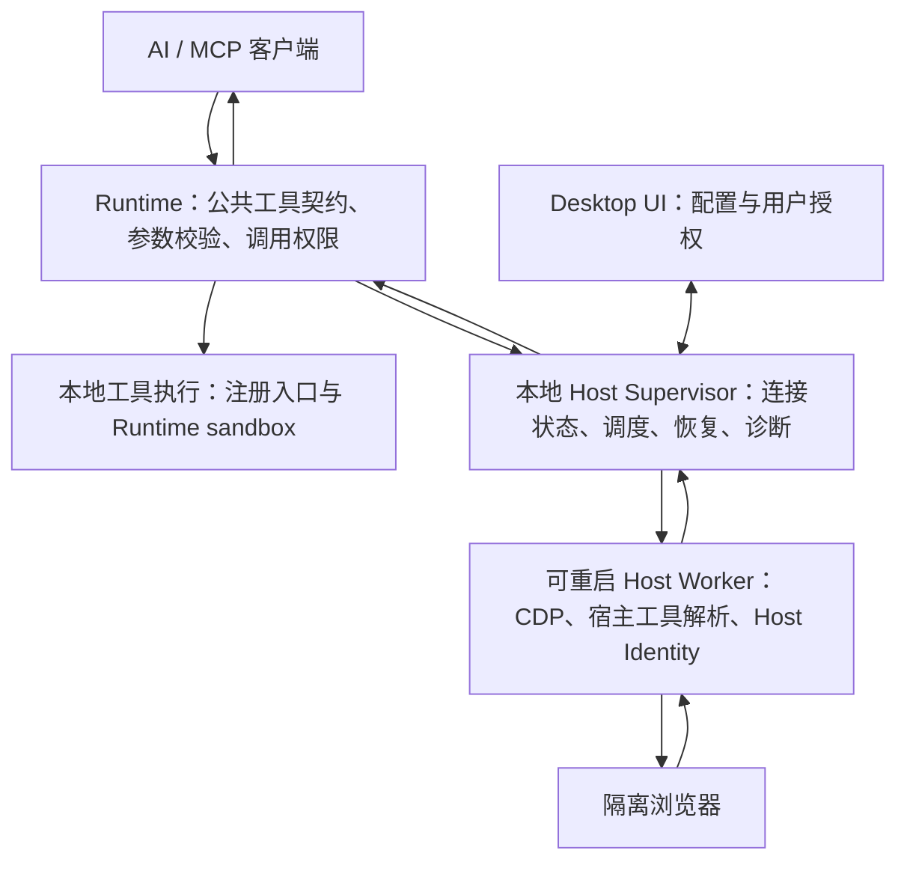

# 浏览器观察与 Host 可靠性：重构设计

状态：建议方案，尚未实施。基线 a80e72f。

## 1. 结论与已核对证据

保留 Runtime / Host 两类执行边界，Browser 后端继续用 CDP。重构目的为统一真实契约与生命周期，不建设第三套工具模型。

源码及最小复现确认：

1. tools/list 根据 mcp_exposed 过滤；effective_tools 不保留此字段；capability_catalog 将每个内部工具名直接填入 invocation.mcp_tool。本地发现 17 个不可直接调用入口：9 个 browser_*、5 个 git_*、kill_command/read_output/write_stdin。
2. capability_catalog 对内置工具默认 available；server_info 的 configured 仅表示 Broker 对象或方法存在，没有在线验证。
3. DesktopPermissionBroker 位于 Desktop 主进程内；同一串行线程处理工具路径解析与 Host Capability，Host Identity 的派发也经过该循环。
4. 已注册工具在 Broker 存在时仍调用 Host 解析以比较路径；缓存未命中时 Host 故障传播到正常命令。
5. browser_manage 的 capabilities 是权限并集、annotations 是统一提示；browser_screenshot 保存 PNG 后只返回路径，已有 Runtime _image 通道未被使用。
6. Desktop 退出会主动 stop_all；Broker 路径与 secret 每次初始化重新生成。不能通过在当前 Broker 增加 restart 方法就实现完整恢复。

用户报告的具体 Host 故障、OS 拒绝、遗留 Workflow 及耗时未在此次真实部署中重演；以上区分源码事实与现场报告。

## 2. 保留三个职责边界



- ToolRegistry 是公共契约唯一来源；服务发现、调用、工作流、Catalog 从它生成。
- Runtime 的本地命令执行不依赖 Host 存活。
- Supervisor 不运行 CDP 或长时间应用解析，它必须在 Worker 卡死时还能回答状态和恢复请求。
- Worker 是独立进程，Supervisor 可回收整个自有进程组；进程隔离有故障恢复需求支撑，不能仅以线程池代替。
- Desktop UI 保持授权和产品交互；用户界面生命周期与 Worker 生命周期分开。Supervisor 在当前 Desktop 服务会话中拥有稳定身份。

不新增通用事件总线、插件框架、任意 RPC 执行器。Supervisor 替换当前 Broker 中混合的执行与调度职责，旧 Host 处理循环应删除。

## 3. 唯一公开工具契约

### Browser

公开现有 browser_open / browser_navigate / browser_snapshot / browser_click / browser_fill / browser_press / browser_screenshot / browser_status / browser_close；删除 browser_manage。

观察入口为 browser_snapshot：直接返回截图以及有界页面文字、交互元素。browser_screenshot 只提供图像观察，并可显式保存；二者复用同一捕获实现。动作返回执行结果，并默认附带一次有界观察；调用方可关闭动作后观察以减少输出。

需要的 scroll / 坐标点击通过实际浏览器验收明确后加入，不为凑通用动作全集预注册。DOM refs 与坐标输入共用 CDP Session；不增加软件专用条件分支。

每个工具单独定义 schema、能力、操作权限和 annotations。不实现 browser_manage 动态 annotations：tools/list 中的注解是工具级提示，不能作为每次调用的权限执行机制。

### Git / Process / 工作流

保留现有正式 MCP 入口作为各域唯一公共调用面；它们的内部细粒度方法不再作为公共 ToolDefinition 注册。已有内部 Workflow 引用在升级时改为公共入口及其参数。不要为了修复目录把所有私有方法无差别公开。

工具注册项应包含 input/output schema、handler、execution_kind、capabilities、operation_permissions、annotations。只在确有参数差异时通过预检返回更细的执行许可要求，不让 facade 权限并集代替逐调用检查。

Catalog 从公共注册项构造可调用项；UI 如需内部编辑信息，用单独的内部操作数据结构，不伪装成客户端工具。

外部 MCP 子工具仍由一个标准连接调用入口承载，这属于真实协议连接，并非旧工具别名兼容。Catalog 的调用目标、固定参数与入参 schema 必须来自该入口定义，并自动校验。技能、工作流不能简单与 tools/list 做名称相等比较，应验证它们的 invocation 指向公共入口。

删除目录中的固定 execution.owner=workbench_runtime 推断；由工具 execution_kind 决定。静态 contract_revision 与动态 health_revision 分开，心跳时间变化不应令 capability_get(expected_revision) 持续失效。

## 4. 健康、连接与可行性分离

一个 available 布尔值或五个可独立冲突的状态均不足够。使用静态能力和单一连接状态：

```json
{
  "contract_version": 2,
  "supported": true,
  "configured": true,
  "connection": {
    "state": "ready",
    "host_instance_id": "host-example",
    "generation": 4,
    "last_seen": "timestamp",
    "heartbeat_age_ms": 120
  },
  "invocation": {
    "exposed_to_client": true,
    "state": "ready",
    "reasons": []
  }
}
```

connection.state 为 disconnected / connecting / ready / degraded / restarting。invocation.state 为 ready / approval_required / unavailable / unknown，并结合当前客户端、参数、平台、策略和 Provider 状态计算；目录无法知道具体参数时，不承诺实际操作一定成功。

心跳目标 250 ms，失效阈值目标 750 ms；这些是验收配置而非已达性能。以本地 monotonic clock 记录接收时间判断存活，wall time 仅供展示。所有请求先读 HostConnection 的缓存状态；已知失联立即返回。即使旧心跳仍新鲜，请求 ack 也设独立上限，端到端断联拒绝预算小于 1 秒。

Supervisor 存活、Worker 响应和 Provider 可用必须区分。心跳不能只由一个与实际执行完全无关的线程不停发送来证明 ready；队列、ack、操作截止时间共同决定 degraded 状态。

## 5. 恢复协议与控制面

### 稳定身份

Runtime 连接稳定 Supervisor，Worker 每次启动增加 generation。每个请求带 request_id、runtime_instance_id、server/profile_id、principal、generation、deadline，并绑定已认证本地连接。

沿用私有 IPC 的签名验证原则；具体端点归 Supervisor 管理。本轮不同时保留旧文件轮询和新控制协议两个活动实现。敏感凭据不得从可任意修改的发现文件盲目刷新；端点发现不等于授权。Runtime 只访问自己的有界 IPC 范围，注册阶段授予的身份和控制权限在 Worker 重启时不扩大。

### 工具

- host_status：Runtime 直接返回连接状态缓存和最近 Supervisor 状态；Worker 已死也必须能调用。
- host_diagnostics：Supervisor 提供当前 Workbench 管理的 Worker / Browser 状态和最近 N 条有界脱敏事件，不暴露裸 ps/log/signal。
- host_reconnect：仅针对当前 Runtime 重新握手、刷新能力；不重启全局 Worker，不隐式重放失败动作。
- host_restart：Supervisor 重启自有 Worker，需要独立管理授权与影响列表；普通 Browser 操作权限不能取得此能力。不能把它实现为任意 PID、bundle 或 launchctl 参数入口。

Worker crash 可自动有界退避重启；连续故障达到阈值后熔断并保持诊断可读，避免无限重启。卡死且操作未完成时先记录执行结果未知，终止旧 Worker 后再恢复。不会自动重发 click/fill 等可能产生副作用的请求。

如果整个 Supervisor/桌面控制进程已不存在，Runtime fail-fast，但不能让失效进程自我重启。要保证 Desktop 全退出后自动恢复，需要额外常驻所有权，本轮不承诺。正常关闭 Desktop 仍停止服务。

## 6. 会话与资源

BrowserSession 绑定 generation、runtime_instance_id、profile/server_id、principal、provider、resource_ownership、last_activity 和 expiry。

Worker 重启后旧 session 一律 SESSION_EXPIRED；工具重新可用不等于旧页面恢复。不可自动新建会话并伪装原 session。

Supervisor 记录自有资源和进程组，Worker 启动时先处理确认为失效 generation 的临时目录。GC 有时长、数量与大小上限，保护活动租约，不依赖可被恶意扩大范围的路径字符串。后续桌面后端连接用户已有应用时只释放控制，不退出应用。

各 session 的动作串行，不同 session 有界并发；桌面输入是共享资源，后续桌面 Provider 需要独立输入互斥。路径解析、Host Identity 和 Browser 队列不相互占用无界等待。停止服务要取消对应 profile 的排队与执行请求。

## 7. 权限与可行性

保留 Capability 与 OperationPermission 区分，并与 MCP annotations 分离。顺序：schema 校验 → 工具暴露/身份与能力检查 → 本地可行性预检 → 所需授权 → 执行前复核 → 执行。

Browser status 只读，限定自己拥有的会话；snapshot/screenshot 属于观察权限；open/navigate/click/fill/press 属于浏览器控制。纯截图不写工作区；只有显式保存路径才请求文件写能力。close 用所有权校验允许清理，不要求新的控制授权。

不要把导航无副作用作为前提：它可能触发请求或站点动作。readOnly/destructive 注解按真实工具行为声明，不以缺少文件写操作推断无副作用。

明确 safe/trusted/dangerous 下每个操作的授予规则，改掉“新增枚举自动进入会话全部允许”的隐式扩权方式。将通用 Runtime 会话授权和 Browser 授权、Host 管理授权分别绑定。应用内批准不能授予缺失的系统辅助功能或解除 Seatbelt 限制。

已知不可行返回 POLICY_DENIED / OS_SANDBOX_DENIED / USER_PERMISSION_REQUIRED；未知不能通过执行危险命令来预检。普通 exit_code=71 不能独自证明 OS_SANDBOX_DENIED，保留原始退出码和有界 stderr，再根据可靠证据分类。

## 8. Runtime 工具解析

将“选择已认可的可执行入口”与“向宿主发现新入口”分离：

1. 验证当前注册及其项目上下文绑定；有效则本地执行。
2. 没有注册时，在明确允许的 runtime safe PATH 解析；执行仍服从 sandbox 和文件身份校验。
3. 使用项目上下文和文件指纹仍有效的缓存；缓存的授权级别不能高于来源。
4. 仍无可用入口时，才经 HostConnection 检查后调用 Host 发现；结果为注册提案，不自动授予执行权限。

顺序是授权范围内的查找顺序，不允许注册失效后静默换版本。项目约束改变应报告 TOOLCHAIN_REGISTRATION_STALE / PROJECT_TOOLCHAIN_MISMATCH，并允许明确重新发现。Host 不可用时只能报告当前注册版本不可满足要求，不能忽略项目版本文件。

删除 _resolve_program 中“已有注册仍必须咨询 Host 比较”的强耦合路径。Host Identity 是显式 use_host_identity=true 的执行选择，不得变为普通 Runtime 命令的失败兜底。

## 9. 图像和操作结果

复用 Runtime 现有 _image → make_tool_result → MCP image 通道，不新增图像网关或另一套结果协议。

Browser 观察返回 observation_id、session_id/generation、url、viewport/图像尺寸、坐标系和有界元素信息；默认直接传图，保存文件是显式动作。图像尺寸和 DPR 参与坐标映射；截图与 DOM 的序列采集不宣称是事务原子快照。页面导航后旧引用失效，有变化需要再观察。

动作的 completed 只表示动作已执行，不代表页面达成业务目标。自动观察失败时保留 action_state=completed 与 observation_error；执行时断联使用 action_state=unknown，避免自动重放。输入参数错误在进入 Host 前拒绝。

## 10. 进程结果与目录体积

不再增加含糊的 transport_ok 与 ok 双套含义。网络/RPC 层已经表达传输结果。统一进程状态 running / succeeded / failed / timed_out / cancelled / lost，并返回 exit_code 与 process_success（运行中或结果未知为 null）。ok=true 在 running 时只表示已受理，终态非零/超时/取消必须为 false 并附结构化错误；客户端、结果摘要和工作流必须先看状态，不能把运行中的 ok=true 作为节点已完成。

此为明确契约变更，进程控制的状态读取也使用同一输出定义。修复期间更新 Workflow 的进程等待/失败语义，不能只修改一个布尔值。

server_info 默认摘要；sections 只包含已实现的定向信息，详情复用 host_diagnostics 与工具目录。不扫描全机，不在 server_info 内触发工具发现。Catalog 静态 revision 不受心跳更新影响。

## 11. 明确删除与延后

删除：browser_manage、重复 Browser 参数规则、伪装成公共工具的私有注册项、目录硬编码 available/owner、普通注册执行前的强制 Host 查询、当前 Broker 的混合串行执行循环。禁止添加旧名到新名转发、旧端点重试和临时 Workflow 绕行。

保留：CDP Provider、OS 注册信息解析、Runtime sandbox、工具注册指纹、权限验证、现有标准图片输出。HostCapability 继续是小接口，不扩展成任意插件装载平台。

延后：通用桌面 Provider、浏览器扩展、独立 Computer Use MCP、ephemeral workflow 引擎、任意应用/系统进程查询。Browser 直接可调用后不再需要为诊断创建 Workflow；已有 DB-015 临时资源只能按明确清单审核清理，不能批量删除用户工作流。

## 12. 模块落点与发布

| 当前模块 | 调整 |
| --- | --- |
| core/tool.py、registry.py、dispatcher.py | 公共工具单一契约，统一校验与执行入口 |
| workbench/effective_tools.py、capability_catalog.py | 从真实公共注册生成目录，健康信息独立投影 |
| tools/browser/*、host_capabilities/browser.py | 原子工具公开、删除 facade、复用观察与图片通道 |
| local_permission_broker.py、runtime/permission_broker.py | 重构为 Runtime HostConnection 与 Supervisor/Worker 协议，删除旧执行循环 |
| host_execution/*、host_identity/* | 保留专业实现，归 Worker 与 Supervisor 生命周期管理 |
| permissions/*、web/src/App.vue | 授权范围与系统可行性明确；UI 抽出 usePermissionRequests，避免继续堆 App.vue |
| tools/process/handlers.py、toolchains/resolver.py | 本地解析优先，注册过期明确失败 |
| processes.py、results.py、workbench/engine.py / runs.py | 统一进程结果与工作流消费逻辑 |
| api/base.py、servers/gateways 生命周期与打包 | 启动稳定 Supervisor 与可重启 Worker，平台依赖按需加载 |
| web/src/types.ts、能力工作台与相关 API | 新目录/健康契约一次性更新 |

不修改 OAuth 登录协议、更新检查算法或网络隧道实现，但服务启停、打包和共享授权界面必须回归。

契约采用新 contract_version（具体版本在实施时确定）；内部 IPC handshake 也显式版本化，不支持不匹配时静默回退。升级前扫描项目内调用、保存的 Workflow、Skills 引用及前端类型；数据迁移作为带备份、预检报告的独立一次性步骤，不留在线调用兼容层。第三方 MCP 客户端需刷新工具列表，外部自定义脚本按发布说明更新。运行代码切换时只保留一条活动路径。
